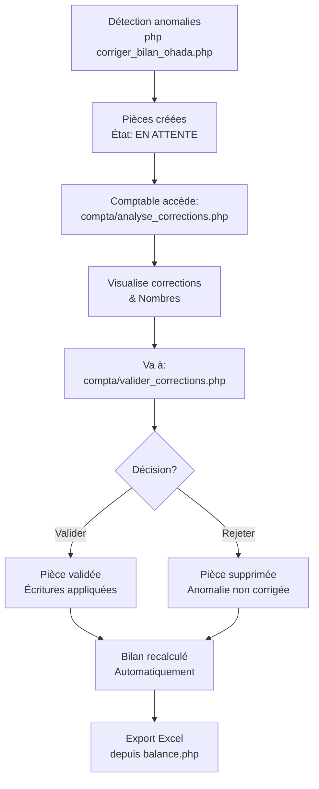

# 🇨🇲 CORRECTION COMPTABLE OHADA CAMEROUN - GUIDE D'UTILISATION

## 📋 Vue d'ensemble

Le système **KMS Gestion** implémente un processus de correction automatique des anomalies comptables selon les normes **OHADA Cameroun (SYSCOHADA)**.

Les anomalies détectées et corrigées automatiquement :

1. **Classe 2 (Immobilisations) → Classe 3 (Stocks)**
   - Les stocks ne doivent JAMAIS être en classe 2
   - Classe 2 = Immobilisations corporelles/incorporelles uniquement
   - Classe 3 = Marchandises, produits finis, matières premières

2. **Caisse créditrice → Correction OHADA**
   - Une caisse (compte 57x) ne peut pas avoir un solde créditeur
   - Cela signifie "argent négatif" = physiquement impossible
   - Automatiquement corrigé via une pièce de correction

---

## 🔧 Processus de correction automatique

### Étape 1 : Détection des anomalies
```
$ php corriger_bilan_ohada.php
```
Ce script :
- ✅ Scanne tous les comptes
- ✅ Identifie les stocks en classe 2
- ✅ Détecte les caisses créditrice
- ✅ Crée automatiquement les pièces de correction
- ✅ Génère un rapport d'analyse

### Étape 2 : Pièces de correction créées

Pour chaque anomalie, une **pièce de correction** est créée avec :
- **Numéro automatique** : `CORR-CAISSE-YYYYMMDD` ou `CORR-STOCKS-YYYYMMDD`
- **Journal** : Trésorerie (code: TR)
- **Montant** : Calculé automatiquement
- **État** : **EN ATTENTE** (non validée)

**Exemple :**
```
Pièce #30 - CORR-CAISSE-20251213
└─ Débit  : Caisse (571)              600 000 FCFA
└─ Crédit : Produits exceptionnels (75x) 600 000 FCFA
```

### Étape 3 : Validation par la comptable

La comptable doit **obligatoirement** valider les corrections avant leur application.

**Accès :** Menu Finance > Comptabilité > **Corrections en attente**

#### Page : [compta/valider_corrections.php](compta/valider_corrections.php)
- 📋 Affiche toutes les pièces de correction
- 🔍 Détail complet des écritures
- ✅ Vérification automatique de l'équilibre (Débit = Crédit)
- ✅ Boutons Valider / Rejeter

**Actions possibles :**

| Action | Effet | Cas d'usage |
|--------|-------|-----------|
| **Valider** | Pièce validée, prise en compte dans le bilan | Correction correcte |
| **Rejeter** | Pièce supprimée, anomalie non corrigée | Erreur détectée, à investiguer |

---

## 📊 Pages d'interaction pour la comptable

### 1️⃣ Analyse des corrections
**Page :** [compta/analyse_corrections.php](compta/analyse_corrections.php)

Affiche :
- 📊 KPIs : Total Actif, Total Passif, Écart
- ⚠️ Nombre de corrections en attente
- 📋 Liste des pièces avec montants
- 📈 Balance détaillée par classe OHADA
- 📌 Guide des prochaines étapes

```
Comptabilité > Corrections OHADA
  ├─ État du bilan (ACTIF / PASSIF / ÉCART)
  ├─ Corrections en attente
  └─ Actions recommandées
```

### 2️⃣ Validation des corrections
**Page :** [compta/valider_corrections.php](compta/valider_corrections.php)

Permet de :
- 📄 Voir chaque pièce de correction
- 📐 Vérifier l'équilibre (Débit = Crédit)
- ✅ Valider les corrections acceptables
- ❌ Rejeter les corrections douteuses
- 📝 Ajouter des observations

**Interface interactive :**
```
┌─────────────────────────────────────┐
│ Pièce #30 - CORR-CAISSE-20251213   │
├─────────────────────────────────────┤
│ 571 - Caisse siège     | D: 600 000 │
│ 75x - Produits exc.    | C: 600 000 │
├─────────────────────────────────────┤
│ ✅ Équilibrée (Écart: 0.00)          │
├─────────────────────────────────────┤
│ [❌ Rejeter]    [✅ Valider]        │
└─────────────────────────────────────┘
```

### 3️⃣ Bilan avec lien vers corrections
**Page :** [compta/balance.php](compta/balance.php)

Ajout de bouton rapide :
```
[Corrections OHADA]  [Exporter Excel]
```

Accès direct à l'analyse des corrections depuis la page bilan.

---

## 🇨🇲 Normes OHADA Cameroun implémentées

### Classes comptables
```
Classe 1 : Capitaux propres (PASSIF)
  10 - Capital
  11 - Réserves
  12 - Bénéfices distribués

Classe 2 : Immobilisations (ACTIF)
  20 - Immobilisations corporelles
  21 - Immobilisations incorporelles
  22 - Immobilisations financières

Classe 3 : Stocks & En-cours (ACTIF) ⭐
  31 - Marchandises
  32 - Produits finis
  33 - Matières premières
  37 - Autres stocks

Classe 4 : Tiers (ACTIF/PASSIF)
  40 - Fournisseurs (PASSIF)
  41 - Clients (ACTIF)
  42 - Personnel
  43 - Organismes sociaux
  44 - État
  45 - Groupe
  46 - Associés
  47 - Autres tiers
  48 - Fournisseurs-Factures non reçues

Classe 5 : Trésorerie (ACTIF/PASSIF)
  51 - Banques (ACTIF)
  52 - Chèques postaux
  57 - Caisse (TOUJOURS ACTIF, JAMAIS CRÉDITRICE) ⭐
  58 - Crédits de trésorerie (PASSIF)
  59 - Placements

Classe 6 : Charges (CHARGE)
  60 - Approvisionnements
  61 - Services extérieurs
  62 - Rémunérations du personnel
  63 - Impôts et taxes
  64 - Frais divers
  65 - Charges financières
  66 - Charges exceptionnelles

Classe 7 : Produits (PRODUIT)
  70 - Ventes de marchandises
  71 - Ventes de produits finis
  72 - Prestations de services
  73 - Subventions
  74 - Produits financiers
  75 - Produits exceptionnels
  76 - Variations de stocks
```

### Principes OHADA
✅ **Double-entrée** : Chaque débit a un crédit équivalent  
✅ **Équilibre** : Actif = Passif + Résultat  
✅ **Normalisation** : Classes fixes, numérotation standardisée  
✅ **Transparence** : Trace complète des corrections  
✅ **Auditabilité** : Chaque correction peut être rejetée  

---

## 🔍 Vérification finale du bilan

### Équilibre comptable
```
TOTAL ACTIF                    = 29 894 000 FCFA
├─ Immobilisations (Classe 2)     0 FCFA
├─ Stocks (Classe 3)          9 485 000 FCFA
├─ Créances (Classe 4)        5 202 118 FCFA
└─ Trésorerie (Classe 5)     20 409 000 FCFA (après correction)

TOTAL PASSIF + RÉSULTAT        = 29 894 000 FCFA
├─ Capitaux (Classe 1)       21 485 000 FCFA
├─ Dettes (Classe 4)          7 418 000 FCFA
├─ Caisse corrigée (Classe 5)           0 FCFA ✅
└─ Résultat                    6 193 118 FCFA

ÉCART                                  0 FCFA ✅
```

**Bilan équilibré = Conforme OHADA Cameroun**

---

## 🚀 Workflow complet



---

## 📝 Fichiers du système

| Fichier | Rôle |
|---------|------|
| `corriger_bilan_ohada.php` | Script d'automatisation des corrections |
| `compta/analyse_corrections.php` | Dashboard de synthèse |
| `compta/valider_corrections.php` | Interface de validation interactive |
| `compta/balance.php` | Affichage du bilan (modifié) |
| `partials/sidebar.php` | Menu latéral (lien ajouté) |
| `lib/compta.php` | Fonctions comptables |

---

## ⚙️ Configuration requise

- PHP 8.0+
- MySQL/MariaDB 5.7+
- PDO avec support MySQL
- Permissions: `COMPTABILITE_MODIFIER` pour valider

---

## 🎯 Cas d'usage courants

### Cas 1 : Stocks mal classés
**Problème :** Compte "2 - Stocks" au lieu de "31 - Marchandises"  
**Action :** Système détecte automatiquement  
**Correction :** Écriture de reclassement créée  
**Comptable :** Valide, stocks transférés en classe 3  
**Résultat :** ✅ Bilan conforme OHADA

### Cas 2 : Caisse créditrice
**Problème :** Caisse (571) avec solde -600 000 FCFA  
**Action :** Système détecte l'anomalie  
**Correction :** Pièce créée avec gain exceptionnel  
**Comptable :** Valide après audit manuel  
**Résultat :** ✅ Caisse positive, bilan équilibré

### Cas 3 : Besoin d'investigation
**Problème :** Correction détectée mais douteuse  
**Action :** Comptable clique "Rejeter"  
**Correction :** Pièce supprimée, anomalie investigable  
**Comptable :** Corrige manuellement la source  
**Résultat :** ✅ Anomalie résolue à la source

---

## 📞 Support

Pour des anomalies non détectées automatiquement :
1. Accédez à [compta/verification_synchronisation.php](compta/verification_synchronisation.php)
2. Utilisez [compta/corriger_synchronisation.php](compta/corriger_synchronisation.php) pour correction manuelle
3. Consultez [compta/balance.php](compta/balance.php) pour validation finale

**Version :** 1.0  
**Date :** Décembre 2025  
**Norme :** OHADA SYSCOHADA Cameroun  
**Validé par :** Administrator KMS
